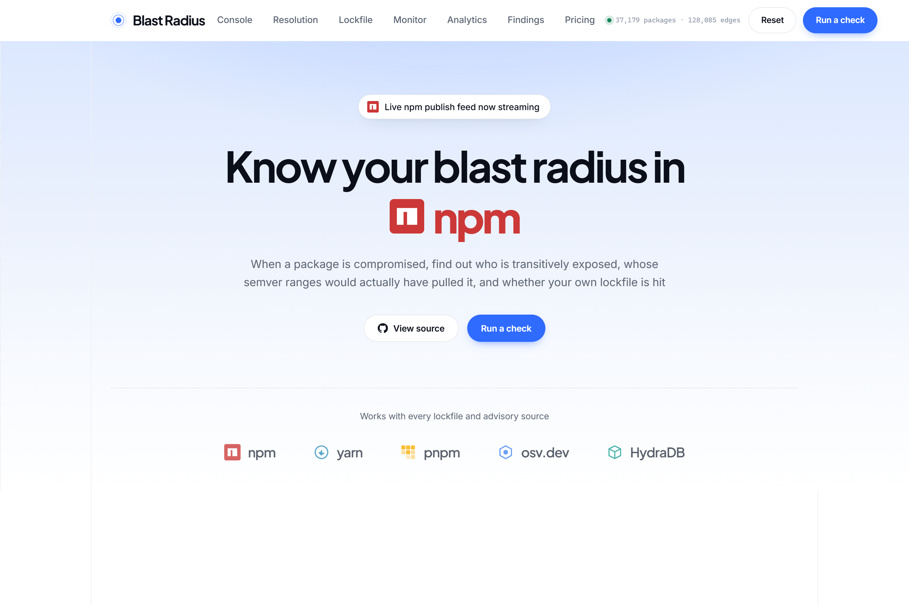
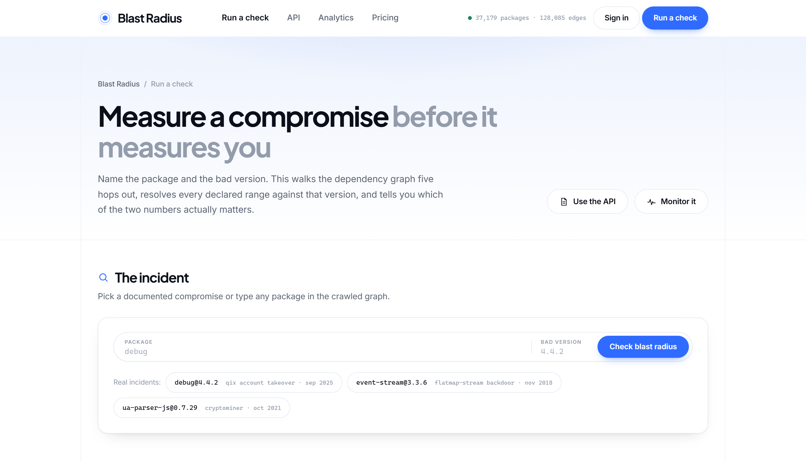
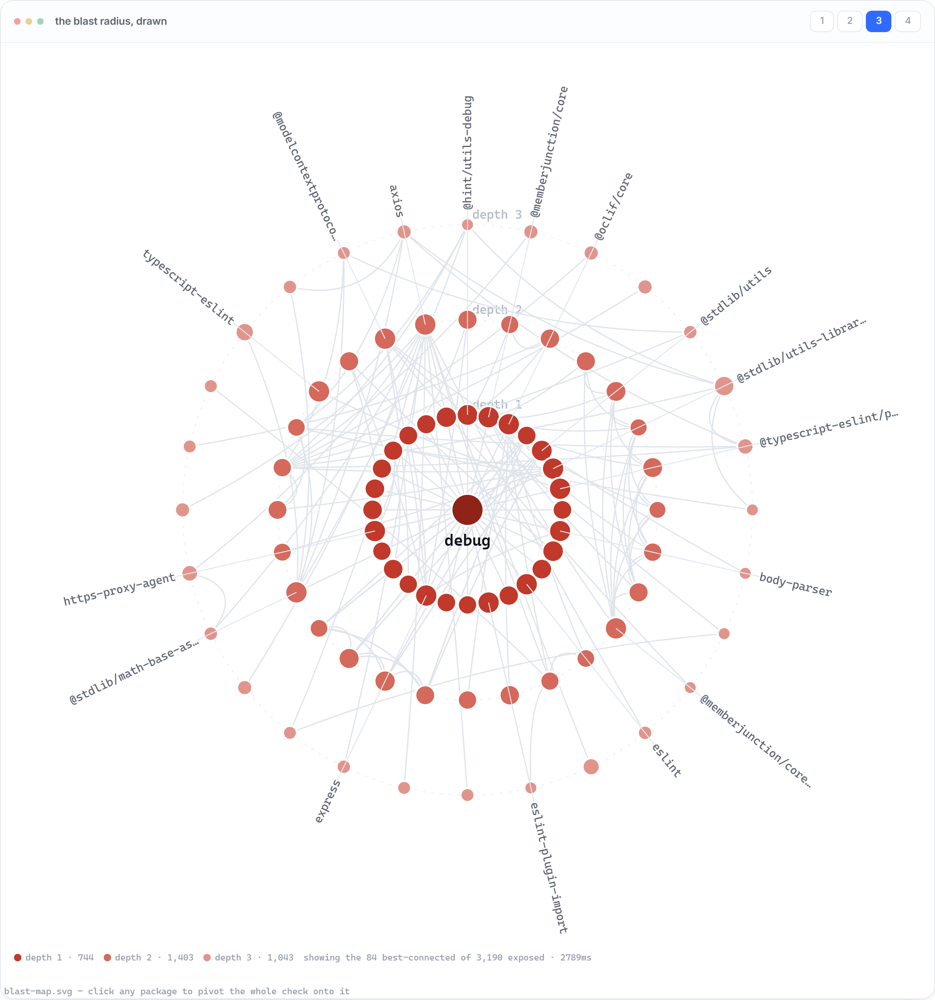
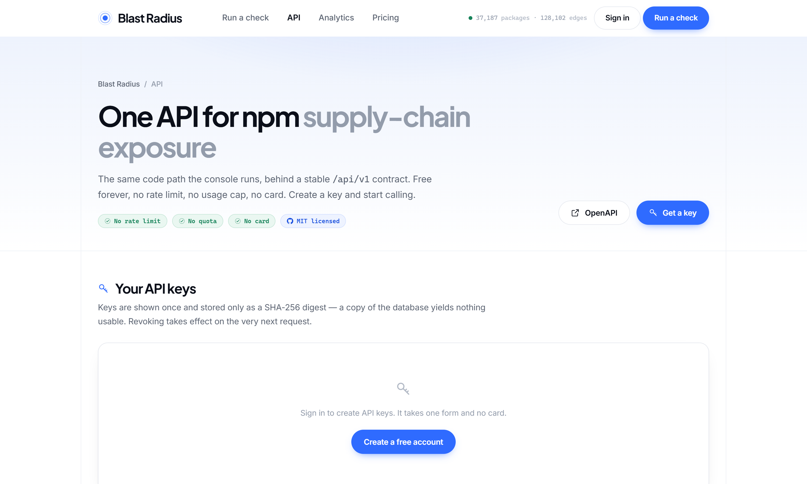
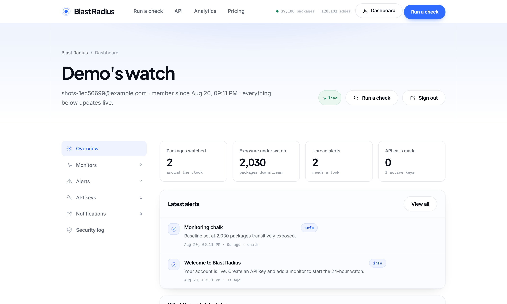
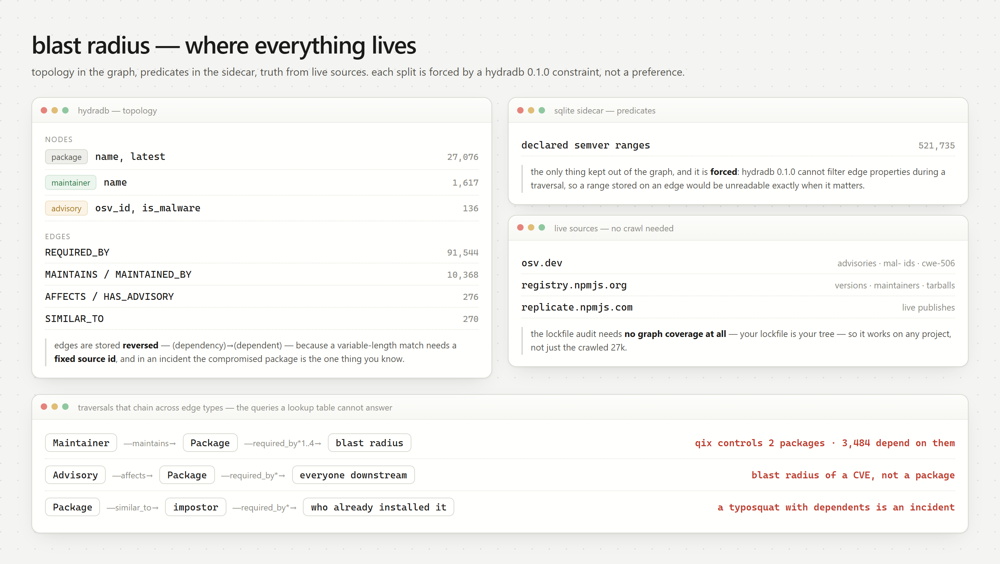
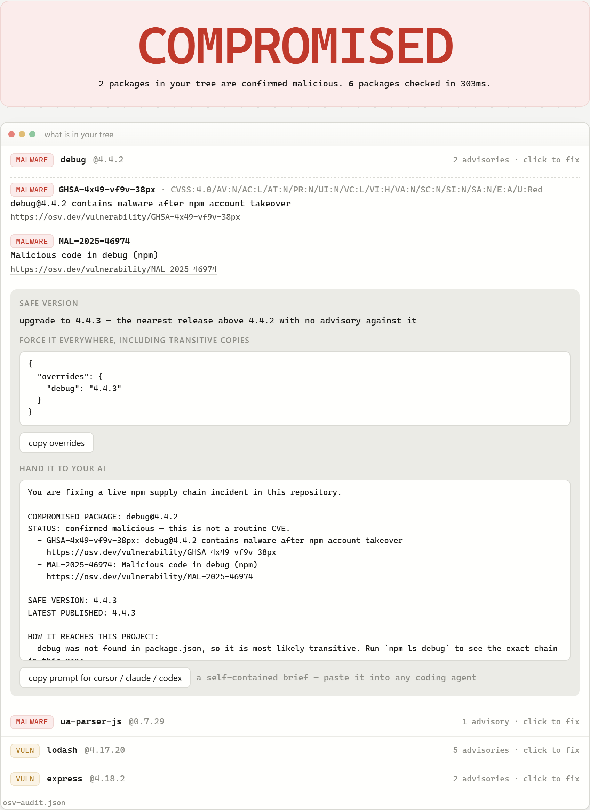
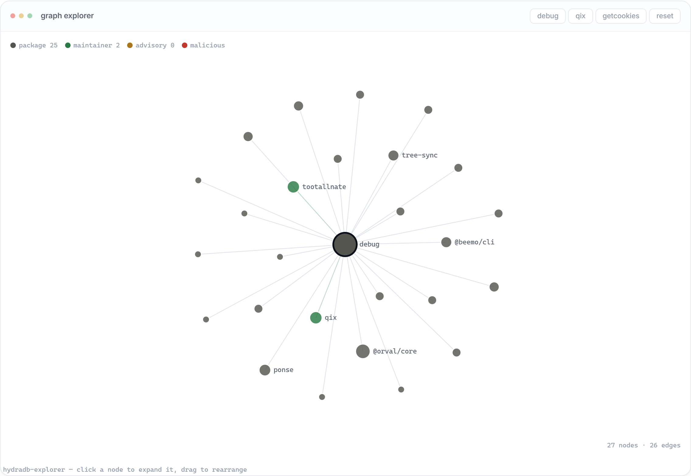
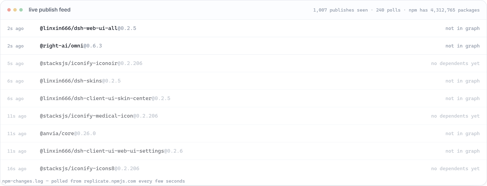

<div align="center">


# Blast Radius

**When an npm package is compromised, find out who is actually exposed —
before anyone opens an advisory.**

[](#verifying-it)
[](LICENSE)
[](#the-api)
[](https://github.com/hydra-db/hydradb)
[](web/)

</div>

---

Four questions matter during a supply-chain incident, and none of them is
"which packages are similar to this one":

|   | Question | Answered by |
| - | -------- | ----------- |
| **1** | **Who is transitively exposed?** Everything that pulls it, five levels down. | one traversal from a known vertex |
| **2** | **Whose semver range would _actually_ have pulled the poison?** Listing a dependency is not the same as resolving to the bad version. | every declared range, evaluated |
| **3** | **Is anything in my project already malicious?** | live against osv.dev, no crawl coverage needed |
| **4** | **How do I fix it?** | the safe version, an `overrides` block, a brief an agent can act on |

```bash
docker compose up -d          # HydraDB
cp .env.example .env          # optional: Supabase, SMTP — see SETUP.md
py setup_check.py             # verifies every credential against the real service
py server.py                  # http://127.0.0.1:8000
```



---

## What you get

Five surfaces, one port, no build step. Every number on every one of them
comes back from a query that was actually run.

| Route | What it is |
| ----- | ---------- |
| `/` | The story, with a live incident chart measured on page load |
| `/check` | **The console** — blast radius, semver split, lockfile check, OSV audit, graph explorer, publish feed |
| `/developers` | **The API** — key vault, quickstarts, a playground that sends real authenticated calls, the full reference |
| `/dashboard` | **Your account** — monitors, alerts, keys, notifications, security log, all live over SSE |
| `/signin` | Sign in / create an account |

### The console

Name a package and a bad version. This walks the graph five hops out, resolves
every declared range against that version, and tells you which of the two
numbers actually matters.



<table>
<tr>
<td width="50%"></td>
<td width="50%"></td>
</tr>
<tr>
<td><b>The radius, drawn.</b> Concentric rings by depth, red attenuating outward. Click any package to pivot the whole console onto it.</td>
<td><b>Measured, not claimed.</b> Every panel carries the latency of the query that produced it.</td>
</tr>
</table>

### The API

Free, no rate limit, no quota, no card. The same code path the console runs,
behind a stable `/api/v1` contract.



```bash
curl -H 'Authorization: Bearer brk_live_...' \
  'http://localhost:8000/api/v1/blast?name=debug&depth=5'
```

```json
{ "total": 3834, "depth": 5, "queries": 6,
  "histogram": [{ "depth": 1, "packages": 744 }, ...],
  "latency_ms": 1492.0, "source": "hydradb", "ok": true }
```

The reference is generated from the same table the router reads, so it cannot
drift — and it is served three ways so an agent can consume it directly:

| | |
| --- | --- |
| `/api/docs.json` | the reference as data |
| `/api/docs.md` | Markdown, written to paste into an AI agent's context |
| `/api/docs.txt` | plain text |
| `/api/docs` | OpenAPI / Swagger UI |

**Keys are never stored.** What is persisted is a SHA-256 digest and a short
non-secret prefix; a copy of the database yields nothing usable. The plaintext
is shown once, at creation, and lives only in the creating tab's memory.

### 24/7 monitoring

Register a package and this instance keeps measuring it. When its blast radius
moves, an alert reaches your dashboard, your webhooks, and your inbox.



```bash
curl -X POST http://localhost:8000/api/v1/monitors \
  -H 'Authorization: Bearer brk_live_...' \
  -H 'Content-Type: application/json' \
  -d '{"package":"debug"}'
```

Deliveries are signed the way Stripe and GitHub sign theirs:

```
X-BlastRadius-Signature: t=1787270000,v1=9f86d081884c7d65...
```

HMAC-SHA256 over `<t>.<raw body>`. The timestamp is inside the signed material,
so a captured payload cannot be replayed. Three attempts with backoff; an
endpoint that fails twenty times in a row is disabled rather than retried
forever.

Accounts are local by default (PBKDF2-HMAC-SHA256, 310k rounds) or **Supabase**
— two lines in `.env`, nothing else changes. See **[SETUP.md](SETUP.md)** for
exactly where each credential goes, and **[PLATFORM.md](PLATFORM.md)** for how
the platform layer is built.

---

## Why this is a graph problem

The question in an incident is **reachability**: who depends on the compromised
package, who depends on them, and so on. That is a transitive closure over a
directed graph.

A vector index cannot express it at all. "Packages similar to `event-stream`" is
not a question anyone asks while their build is shipping a crypto miner.

But the argument is not really about one traversal. It is about **chaining
across relationship types**. "Which packages does `qix` maintain" is a join.
"How many packages transitively depend on anything `qix` maintains" crosses two
relationship types and changes answer the moment any edge anywhere in the graph
moves. That is a graph question, and it is the one that matters after a
maintainer gets phished.

## Everything is a node



```
(:Package    {id, name, latest})
(:Maintainer {id, name})
(:Advisory   {id, osv_id, severity, is_malware, summary})

(dependency)-[:REQUIRED_BY]->(dependent)      91,544
(:Maintainer)-[:MAINTAINS]->(:Package)         5,184
(:Package)-[:MAINTAINED_BY]->(:Maintainer)     5,184
(:Advisory)-[:AFFECTS]->(:Package)               138
(:Package)-[:HAS_ADVISORY]->(:Advisory)          138
(:Package)-[:SIMILAR_TO]->(:Package)             270
```

37,237 packages · 128,228 dependency edges, and still growing — the crawler
runs continuously, so these are a snapshot rather than a fixed size.
`/api/stats` is the live count.

Ids are namespaced through `nid()` — `nid("maint:qix")`,
`nid("adv:MAL-2025-46974")` — so three entity kinds share one integer id space
without colliding.

Every relationship is stored **in both directions**. That is not redundancy: a
variable-length `MATCH` requires a fixed source id, so without the reverse edge
there is no way to ask "who maintains this package" starting from the package.

## The chained traversals

Each stage is anchored at a known vertex because the engine requires it, and the
stages run concurrently.

### 1. What one compromised account can reach

```cypher
MATCH (m {id: $maintainer_id})-[:MAINTAINS]->(p) RETURN p.name
-- then, per package, concurrently:
MATCH (t {id: $package_id})-[:REQUIRED_BY*1..4]->(v) RETURN count(*)
```

> **qix controls 2 packages. 3,484 packages depend on them.** — 803 ms

The union is counted, not the sum: packages by one author share most of their
downstream, and adding the counts double-counts it. The September 2025
chalk/debug attack began with exactly one account.

### 2. Why am I exposed — the actual chain

`GET /api/why-exposed?from=debug&to=express`

The depth at which the target becomes reachable is computed in the graph and is
authoritative. The concrete path cannot be — HydraDB 0.1.0 returns no path
binding — so it is rebuilt from the sidecar edge table and then **every hop is
re-confirmed against the graph**, with `graph_verified` reported honestly.

### 3. Blast radius of a CVE, not a package

```cypher
MATCH (a {id: $advisory_id})-[:AFFECTS]->(p) RETURN p.name
-- then REQUIRED_BY outward from each affected package
```

An advisory usually names several packages. "How far does GHSA-xxxx reach" is a
different question from asking about any one of them.

### 4. Typosquats that already have victims

```cypher
MATCH (p {id: $package_id})-[:SIMILAR_TO]->(q) RETURN q.name
-- then, per neighbour: how many packages already depend on it
```

A near-miss name nobody uses is trivia. One with real dependents means somebody
has already installed the wrong thing.

## The reversed-edge decision

Edges are stored **backwards**: `(dependency)-[:REQUIRED_BY]->(dependent)`.

`express` depends on `debug`, so the natural edge is `express -> debug`. We
store `debug -> express`. The reason is a hard constraint:

```
"variable-length MATCH requires a fixed source id"
```

With natural edges, "who transitively depends on `debug`" means starting from
every possible dependent — an unbounded set of sources, which the engine
refuses. Reversed, the traversal starts at `debug`, and in an incident the
compromised package is the one thing you know for certain. The write path pays a
trivial cost (swap two fields); the read path becomes one legal traversal
instead of an illegal scan.

### The radius, drawn

Concentric rings by dependency depth, red attenuating outward. A node's ring is
a real property of the graph — the depth HydraDB first reaches it at — not a
layout convenience. Click any node and the whole console pivots onto it.


## Two layers, on purpose

| layer | store | holds |
|---|---|---|
| topology | HydraDB | packages, maintainers, advisories, every edge between them |
| predicates | SQLite (`deps.db`) | declared semver ranges |

Only semver ranges stay out of the graph, and that is forced — HydraDB 0.1.0
cannot filter on edge properties during a traversal:

```
"variable-length relationship bindings are not executable in Query engine"
```

A range stored on an edge would be unreadable at exactly the moment it matters.

## What is live, and what is crawled

Being precise about this matters more than sounding impressive.

| capability | coverage | source |
|---|---|---|
| **Lockfile audit** — is anything in my tree malicious | **all of npm** | osv.dev, live |
| **Package intel** — real, current, compromised | **all of npm** | registry + osv.dev, live |
| **Remediation** — safe version, overrides, agent brief | **all of npm** | osv.dev, live |
| **Typosquat existence check** | **all of npm** | registry, live |
| **Live publish feed** | **npm, PyPI, crates.io, Go, Maven** | all five change feeds, polled |
| **Blast radius / chained traversals** | 31,500+ packages, growing live | HydraDB graph |
| **Project monitoring + alerts** | any lockfile, 5 ecosystems | HydraDB traversal |

The universal features need no crawl — your lockfile *is* your tree. The graph
powers the differentiated layer on top. Every API response carries
`graph_coverage`, so the caveat travels with the data instead of living in a
footnote.

Drop a real lockfile and every resolved package goes to OSV. Expanding a finding
loads the fix inline — the safe version, the `overrides` block that forces every
transitive copy, and a self-contained brief for a coding agent:



## The graph writes itself

`ingest.py` is a batch crawl: it walks a frontier, fills the graph, and stops.
That is fine for building a snapshot and wrong for a tool whose entire claim is
answering *who is exposed right now*. A blast radius computed against a graph
written thirteen hours ago describes a dependency tree that has since changed.

So [`live.py`](live.py) runs all five registries' change feeds continuously and
writes what they report straight into HydraDB — one poller per registry, one
writer, per-registry backoff. `GET /api/live/status` reports what is actually
happening rather than what is supposed to be:

| registry | polled every | source |
|---|---|---|
| npm | 5s | `replicate.npmjs.com/_changes?since=` |
| PyPI | 15s | the RSS newest-packages feed |
| Go | 20s | `index.golang.org/index?since=` |
| crates.io | 30s | the summary endpoint |
| Maven | 60s | Central search, sorted by publish timestamp |

A registry having a bad afternoon backs off exponentially and says so; it does
not take the other four down, and it does not sit there looking green. An
ecosystem that has never seen a publish reports `last_event_at: null` rather
than a plausible-looking timestamp.

**Growth is budgeted, and that is the interesting part.** Continuous ingestion
adds roughly 21,000 edges an hour, and this graph stops answering depth 4 and 5
*at all* somewhere around 246,000 edges — the same cliff that broke an earlier
phase. Left alone, live ingestion would have destroyed the thing it was
feeding, inside an afternoon, and the failure would have looked like HydraDB
being slow rather than like a crawler with no brakes. Past `BLAST_EDGE_BUDGET`
the crawler keeps refreshing packages it already knows — the security-relevant
work, which adds almost no vertices — and stops discovering packages nobody
depends on yet. Coverage of the whole registry was never the goal.

One honest consequence: the d+1 traversals behind a blast radius run
concurrently against a graph that is being written to, so they do not observe
the same instant. When nothing is truncated the enumerated victim list is
treated as ground truth and the counts are clamped to it, so the histogram
always sums to the headline instead of shipping a visible off-by-one.

## Monitoring: the traversal *is* the alert router

Register a lockfile and it becomes a `Project` vertex with one `REQUIRED_BY`
edge per installed package — the same edge direction the dependency graph
already uses, deliberately. "Who do I wake up about this publish" then stops
being a fan-out over a subscriber table and becomes the query this database
exists for:

```cypher
MATCH (p:Package {id: $published})-[:REQUIRED_BY*1..N]->(t:Project)
RETURN t.pid
```

One traversal from the package that just changed, and out comes the exact set
of affected projects. Measured at 6–35ms.

**Exact versus inferred.** A lockfile is the resolved tree — everything
installed is named in it — so every package becomes a direct edge and depth 1
is a complete and precise answer. A manifest (`package.json`, `pyproject.toml`,
`pom.xml`) names only direct dependencies, so the rest is reached by traversing
the crawled graph and is exactly as complete as our coverage of it. Those are
different claims, and every alert says which one it is.

Fourteen project-file formats, detected by filename and then by content:

| ecosystem | exact (resolved tree) | inferred (manifest) |
|---|---|---|
| npm | `package-lock.json`, `npm-shrinkwrap.json`, `yarn.lock`, `pnpm-lock.yaml` | `package.json` |
| PyPI | `poetry.lock`, `Pipfile.lock`, `uv.lock`, pinned `requirements.txt` | `pyproject.toml`, ranged `requirements.txt` |
| crates.io | `Cargo.lock` | `Cargo.toml` |
| Go | `go.sum` | `go.mod` |
| Maven | `gradle.lockfile` | `pom.xml`, `build.gradle` |

A ranged requirement records an *empty* version and downgrades the project to
inferred — never the range text stored where a resolved version belongs. That
is the same rule as `satisfies()`: listing a dependency and pulling a specific
version are different facts.

### Wiring it into a real project

```bash
# register once — the token is shown once and is not recoverable
curl -X POST "http://localhost:8000/api/watch/register?name=payments&filename=package-lock.json&webhook=https://hooks.example.com/blast" \
     --data-binary @package-lock.json
# {"project_id":"gFrLfOML7nFr","token":"…","watching":412,"precision":"exact","depth":1}
```

Then take alerts whichever way suits the system:

```bash
# poll — `since` is the last id you handled, so you get what is new and nothing twice
curl "http://localhost:8000/api/watch/$ID/alerts?token=$TOKEN&since=$CURSOR&min_severity=high"

# or hold a stream open; a heartbeat every 15s distinguishes quiet from dead
curl -N "http://localhost:8000/api/watch/$ID/stream?token=$TOKEN"
```

Or point the webhook at an n8n Webhook node and route from there — an alert is
a flat JSON body with `severity`, `kind`, `package`, `version`, `hops`,
`precision` and the OSV advisories attached, which is enough to branch on
without any further lookups.

A webhook that fails is retried with backoff and its failure shows up on
`GET /api/watch/{id}` as `webhook_failures` and `last_webhook_error`. An alert
is written to SQLite before delivery is attempted, so it is never lost — an
alert nobody received is worse than one that arrived late.

Severity comes from asking OSV about the exact version that was just published,
in that package's own ecosystem. A version-less question returns every advisory
ever filed against the package, which would make a routine release of anything
with history look like an incident.

| severity | when |
|---|---|
| `critical` | OSV classifies the new version as malware |
| `high` / `medium` | it carries a real advisory |
| `info` | a clean publish — still the event you want, and the only warning that exists before an advisory does |

## HydraDB 0.1.0: constraints we hit and engineered around

The organizers asked people to surface what does not work. Everything here was
found empirically; [`probe_constraints.py`](probe_constraints.py) prints a
PASS/FAIL table and flags any row where a constraint no longer holds.

**A list in a README is a claim, so the running server publishes it as a
measurement instead.** [`/constraints`](constraints.py) re-derives this entire
section against the live database every five minutes — 25 probes, each with the
query it ran and what came back. The silent-failure traps below are shown
*twice*: the query that lies, beside the query that does not, with both results
as they came back seconds ago. If a constraint ever stops holding, the page says
SURPRISE and shows what it got instead, because a page that can only agree with
itself is not evidence of anything.

### Rejected outright

| what we tried | what HydraDB said | what we did instead |
|---|---|---|
| string vertex ids | `field id must be a non-negative integer` | `nid()` derives a 51-bit int from the name |
| `CREATE INDEX` | `expected query, got CREATE INDEX` | no index needed — ids are derived |
| `MATCH … MERGE` in `UNWIND` | `UNWIND MATCH must end in RETURN or DELETE` | `CREATE` with explicit ids |
| bare `MERGE … SET` | `MERGE with following clauses is not executable` | every write goes through `UNWIND` |
| `length(path)` | `RETURN supports <binding>.<property> or count(*)` | difference `count(*)` per depth |
| var-length `MATCH`, no fixed source | `requires a fixed source id` | reversed edges |
| edge property filters mid-traversal | `relationship bindings are not executable` | ranges live in SQLite |
| bare `MATCH (n)` | `requires an id, label, or property predicate` | always scope by label or id |
| `count(DISTINCT x)` | `DISTINCT aggregate arguments are not executable` | `RETURN DISTINCT` + count client-side |
| `*1..$depth` as a parameter | `requires an explicit max hop` | interpolate a clamped integer |
| result limit > 100,000 | `query_result_limit rejected by admission control` | clamp to `RESULT_LIMIT` |
| `feed=continuous` (npm, not HydraDB) | `400 Bad Request` | poll `_changes?since=<seq>` |

### The ones that fail silently — far more expensive

**1. An id-only `MATCH` can never say "no".**
`MATCH (p {id: $id}) RETURN p.name` returns a row of nulls for an id never
written. Scoping to `:Package` makes it an existence test. Until we found this,
every unknown package reported an empty blast radius — which reads as *safe*,
the worst possible way to be wrong.

**2. `{"type": "null"}` has no `value` key.**
Other typed values are `{"type": "string", "value": "debug"}`. A client that
unwraps only two-key dicts leaves a null as a truthy dict, so an absent property
reads as present. This compounded trap 1 exactly.

**3. Results page at 1024 rows.**
Every response carries `next_cursor`; ignoring it silently truncates every large
answer. Continuing a page needs **both** the cursor and the originating
`query_id`.

**4. `count(*)` on a variable-length match counts reachable vertices, not paths.**
Good news, and load-bearing: it makes the depth histogram exact and cheap.
Verified against a deliberately diamond-shaped graph in
[`probe_counts.py`](probe_counts.py).

**5. A restarted store is permanently read-only.**
SlateDB cannot update an existing manifest on the local filesystem backend:
`Operation put_opts with mode PutMode::Update not yet implemented`. Reads stay
perfect; every write returns 500 forever. Only a write reveals it, so
`/api/health` round-trips one on a timer and [`rebuild.py`](rebuild.py) replays
the whole graph from the sidecar in about a minute.

**6. `/readyz` is not a readiness signal for queries.**
It returns 200 within a second of a restart while deep traversals still fail the
engine's own 30-second query ceiling. The server warms itself, walking depths
1→5 in order because each depth caches the pages the next needs.

**7. Traversal cost scales with *total store size*, not the edges walked.**
This one nearly sank the project. Loading all 77,232 maintainer links (plus the
reverse) tripled the store to ~246,000 edges, and depth-4 and depth-5
`REQUIRED_BY` traversals — which never touch a maintainer edge — stopped
completing at all. After capping maintainer edges to packages with ≥10
dependents (~102,000 edges total), depth 5 completes in **860 ms on a cold
store, first attempt**. There is a practical ceiling here, and it is a property
of the store, not of the query.

## Two accuracy bugs, both erring toward alarm

The alarming direction is the dangerous one for a security tool.

**Classifying malware from advisory prose.** Scanning summaries and details for
words like "malicious" labelled **`express` as malware**, because ordinary
vulnerability write-ups describe attacker behaviour in exactly those words.
Classification now reads structured fields only: a `MAL-` id, a
`malicious-packages-origins` record, or **CWE-506 (Embedded Malicious Code)** —
which both the 2018 event-stream backdoor and the 2025 debug takeover carry.

**Querying OSV without a version.** A version-less query returns every advisory
ever filed against a package across its whole history, so every popular package
looked compromised. `assess()` now resolves `latest` first and asks about that.
**`debug@4.4.2` is malicious; `debug@4.4.3` is clean.**

The same lesson hit the tarball scanner, which rated **`esbuild`** as
`malicious_pattern` — a compiler legitimately runs a postinstall and spawns
processes. Capability and intent are now separate: the scan reports what a
package *can do*, and only the diff against the previous release reports what
this version *added*.

## The advisory outlives the artifact

`debug@4.4.2` and `ua-parser-js@0.7.29` have both been **unpublished from npm**.
The publish timestamp survives in `time` while the release is gone from
`versions` — itself a strong signal, and detected and reported as such.

- OSV is the **durable** layer; the bytes are not.
- Tarball analysis is a **pre-disclosure** tool, not a forensic one.
- A lockfile still pinning that version will now *fail to install*, which is
  often how a team first notices.

## Benchmarks

Full numbers in [BENCHMARKS.md](BENCHMARKS.md). The short version: the identical
transitive closure is computed in HydraDB and in a SQLite recursive CTE, the
counts are **cross-checked before the times are compared**, and both engines
agree on every row. **SQLite is 7–10× faster at this graph size**, and that
result leads the document rather than hiding in it.

A rigged table would be worthless in a pitch. What the graph model buys here is
not raw speed at 27k vertices — it is that `-[:REQUIRED_BY*1..5]->` stays one
clause as the depth bound changes, against a hand-written fixpoint whose
correctness depends on getting `UNION` vs `UNION ALL`, depth accounting and
cycle termination right. Both implementations are in this repo; compare them.

## Setup (Windows)

Tested on Windows 11, Python 3.14, Docker Desktop. Use `py`, not `python3`.

```powershell
mkdir .hydradb\store, .hydradb\cache
"local-development-token-32-bytes" | Out-File -Encoding ascii .hydradb\auth-token
docker compose up -d
py -m pip install -r requirements.txt
py hydra.py                       # waits for readiness, round-trips a write

# Build the graph: crawl npm (~20 min), or replay a deps.db you already have
py expand_seeds.py --out seeds_expanded.txt --target 80000
py ingest.py --seeds seeds_expanded.txt --max-packages 40000 --max-versions 5
py graphify.py                    # maintainers, advisories, similarity
#   ...or, with deps.db in hand:  py rebuild.py --yes

py server.py                      # http://127.0.0.1:8000
```

The console works while the crawl is still running: a package not yet reached
returns an explicit `not_in_graph` with current progress, never an empty result
that looks like safety.

### Accounts, keys and alerts

Optional, and off until you configure it. Copy the template and fill in what
you want:

```powershell
copy .env.example .env
py setup_check.py                 # opens a connection to every service
```

`setup_check.py` never reads a setting and declares victory — it talks to
Supabase, to the graph, to your SMTP host and to a webhook endpoint if you
give it one. A green line means that thing worked, just now.

```
3 · authentication
  PASS  Supabase reachable at https://xxxx.supabase.co
  PASS  SUPABASE_ANON_KEY accepted by the project
  PASS  email sign-up is enabled on the project
```

With an empty `.env` the whole product still runs, using local password auth
and in-app alerts. **[SETUP.md](SETUP.md)** says which line each credential
goes on.

## Verifying it

```powershell
py -m pytest tests -q      # 381 tests
py setup_check.py          # every credential, against the real service
py verify.py               # drives the live stack, per-endpoint success + latency
py verify.py --soak 300    # sustained load, measured success rate
py web_audit.py            # clicks every control, asserts each did something
py chaos.py                # stops HydraDB, proves the recovery
py demo_check.py           # pre-recording gate: 21 checks
```

`tests/test_integration.py` is the one that matters most: it walks the whole
product over real HTTP — sign up, mint a key, call the public API, register a
monitor and a webhook, wait for the watch to measure it, verify the HMAC on the
delivered alert, read that same alert back through the dashboard *and* the API,
then revoke the key and confirm the door shut. It has already earned its place
twice, catching an endpoint that was documented but never routed, and a
response envelope the `/api/v1` router silently did not inherit.

`web_audit.py` earned its place by finding a real defect: the autocomplete
dropdown was painting *underneath* the preset chips, so a click in the overlap
selected a chip instead of the suggestion. It now asserts against
`elementFromPoint`, so "visible to a selector but unclickable to a person"
cannot pass again.

## Use it in CI

The CLI exits non-zero when your tree contains malware, which is what makes it
able to fail a build.

```bash
py cli.py audit ./package-lock.json     # also yarn.lock and pnpm-lock.yaml
py cli.py audit ./pnpm-lock.yaml --json
py cli.py blast debug --depth 5
py cli.py intel debug 4.4.2
py cli.py fix debug 4.4.2
```

| exit | meaning |
|---|---|
| `0` | clean |
| `1` | something in the tree is **confirmed malicious** |
| `2` | known vulnerabilities (only with `--fail-on vuln`) |
| `3` | the scan could not be completed |

Malware and vulnerabilities are separate codes on purpose: one means somebody
attacked you, the other should not wake anyone at 2am.

```yaml
# .github/workflows/supply-chain.yml
name: supply chain
on: [push, pull_request]
jobs:
  blast-radius:
    runs-on: ubuntu-latest
    steps:
      - uses: actions/checkout@v4
      - uses: actions/setup-python@v5
        with: { python-version: "3.12" }
      - run: pip install -r requirements.txt
      - run: python cli.py audit ./package-lock.json
```

`audit` talks only to osv.dev and the npm registry — no HydraDB, no crawl — so
it runs in a bare CI container.

## API

Two surfaces, deliberately.

**`/api/v1/*`** is the public contract: key-authenticated, versioned, free and
uncapped, and the one an integrator should build against. Full reference on
`/developers` or at `/api/docs.md`.

```
GET  /api/v1/whoami        GET  /api/v1/blast         GET  /api/v1/resolve
GET  /api/v1/maintainers   GET  /api/v1/typosquats    GET  /api/v1/subgraph
POST /api/v1/lockfile      POST /api/v1/audit
GET  /api/v1/monitors      POST /api/v1/monitors      DELETE /api/v1/monitors/{id}
GET  /api/v1/alerts        GET  /api/v1/webhooks      POST   /api/v1/webhooks
```

**Everything below** is the console's own surface — unversioned, unauthenticated
on loopback, and free to change as the console changes. Useful to read; not
something to pin a build to.

| endpoint | answers |
|---|---|
| `GET /api/health` | per-component liveness, uptime, cache, OSV reachability |
| `GET /api/stats` | graph size, crawl progress |
| `GET /api/events` | SSE: live system state **and** npm publishes |
| `GET /api/feed` | recent npm publishes, enriched with reach |
| `GET /api/blast` | victims + depth histogram |
| `GET /api/subgraph` | drawable slice: nodes by depth + edges |
| `GET /api/expand` | one node and its neighbours, every edge type |
| `GET /api/attack-surface` | Maintainer → Package → blast radius |
| `GET /api/why-exposed` | the verified chain between two packages |
| `GET /api/blast-advisory` | Advisory → Package → blast radius |
| `GET /api/typosquat-risk` | similar names ranked by dependents |
| `GET /api/intel` | is a package real, current, compromised |
| `POST /api/audit` | scan a lockfile against osv.dev (4 formats) |
| `GET /api/fix` | safe version, overrides, agent brief |
| `GET /api/scan` | read the published tarball, diff releases |
| `GET /api/resolve` | exposed vs shielded by pin |
| `GET /api/maintainers` | what else those maintainers publish |
| `GET /api/search` | package name autocomplete |
| `GET /api/constraints` | re-derive HydraDB's limits against the live database |
| `GET /api/live/status` | per-registry ingestion health, edge budget |
| `GET /api/live/events` | packages written into the graph, newest first |
| `POST /api/watch/register` | register a lockfile or manifest for monitoring |
| `GET /api/watch/{id}/alerts` | poll alerts since a cursor |
| `GET /api/watch/{id}/stream` | SSE, one message per routed publish |
| `POST /api/watch/{id}/ack/{n}` | acknowledge an alert |
| `DELETE /api/watch/{id}` | stop watching and drop the edges |
| `GET /api/watch` | aggregate monitoring counters |

Every response on both surfaces carries `latency_ms` measured around the real
query, plus `ok`, `source`, `graph_coverage`, `cached` and `request_id` — so one
`if (!body.ok)` check works everywhere, and any answer can be traced back to a
line in the log. Interactive docs at `/api/docs`.

## Walk the graph yourself

Every circle is a HydraDB vertex. Clicking one asks the database what is
adjacent to it, across all six edge types — the browser holds no model of the
graph. Colour is by node kind, size by dependent count, red for malicious.



## npm, right now

Every package published in the last few minutes, checked against the graph as it
arrives. Most publishes are somebody's first version with nothing downstream —
the ticker dims those and highlights the packages thousands of things already
depend on, because that is the moment a supply-chain attack goes live.



## Demo safety

`DEMO_MODE=1` serves responses captured from real runs. Independently of that
flag, a capture is used as a **fallback** whenever a live call fails, so a
dropped connection shows the real answer from ten minutes ago instead of a stack
trace. Anything served that way is flagged `demo: true` — a fixture presented as
a live query would be a lie. Verified by stopping HydraDB entirely: the console
kept answering.

## Layout

```
hydra.py               HydraDB client: nid(), cursor paging, retry policy, budgets
ingest.py              npm crawler -> HydraDB + deps.db sidecar
graphify.py            maintainers, advisories, similarity -> graph nodes
blast.py               blast radius, lockfiles, npm semver
chains.py              the traversals that cross edge types
ecosystems/            one adapter per registry — each with its OWN range grammar
                         npm.py     bare version == exact pin
                         pypi.py    PEP 440; ~= pins one component fewer than written
                         crates.py  bare version == caret, the inverse of npm
                         golang.py  no ranges at all; a require is an MVS floor
                         maven.py   bare version is a soft *recommendation*
constraints.py         live verification of HydraDB's limits -> /constraints
intel.py               live registry + OSV: real, current, compromised
live.py                continuous ingestion — five change feeds -> HydraDB
watch.py               project registration + alert routing by traversal
scan.py                tarball static analysis + version diffing
lockfiles.py           14 project-file formats across the five ecosystems
feed.py                live npm publish poller
server.py              FastAPI: 27 endpoints, serves the console on one port
cli.py                 CI-usable CLI with meaningful exit codes
web/                   the console — vanilla HTML/CSS/JS, no build step
bench.py               HydraDB vs SQLite recursive CTE -> BENCHMARKS.md
rebuild.py             replay the graph from deps.db
verify.py / web_audit.py / chaos.py / demo_check.py
probe_constraints.py / probe_counts.py
tests/                 328 tests — semver, graph, HTTP, browser
```

The console has **no build step and no JavaScript dependencies** — the radial
map, the force-directed explorer and the live ticker are all hand-rolled. Partly
taste, partly demo safety: a CDN script tag is the one dependency that can fail
while you are recording.

## Data

Package metadata fetched live from the [npm registry](https://registry.npmjs.org),
[PyPI](https://pypi.org), [crates.io](https://crates.io), the
[Go module proxy](https://proxy.golang.org) and
[Maven Central](https://repo1.maven.org). Advisories from
[OSV.dev](https://osv.dev). Publish feeds from `replicate.npmjs.com`,
PyPI's RSS, `index.golang.org`, the crates.io summary endpoint and Central's
search index. npm registry data is provided by npm, Inc.

The incidents referenced (`debug`/`chalk` via the qix account takeover,
September 2025; `event-stream`, November 2018; `ua-parser-js`, October 2021) are
real, publicly documented attacks. The blast radius figures shown for them are
computed live from the crawled graph.

## Known limitations

- The graph holds 27,076 packages, not all 4.3M. Traversal features are limited
  to that corpus; audit/intel/fix are not.
- There is a practical store-size ceiling around ~100k edges before depth-5
  traversals stop completing (constraint 7 above).
- Graph edges come from each package's **latest** version's `dependencies`.
  `peerDependencies` are recorded but are not edges — npm does not install them
  transitively, so counting them would overstate exposure.
- Semver covers `^ ~ >= > <= < = * x ||` and hyphen ranges. Git URLs, `file:`,
  `npm:` aliases and workspace protocols return `False` rather than guessing.
- The live feed polls; npm rejects `feed=continuous`. It runs seconds behind.
- Maintainer edges exist only for packages with ≥10 dependents.
- `nid()` collisions are theoretically possible (~2e-6 over 100k names); the
  crawler records the name→id map and the suite asserts zero collisions across
  the entire corpus.

## License

MIT — see [LICENSE](LICENSE).
